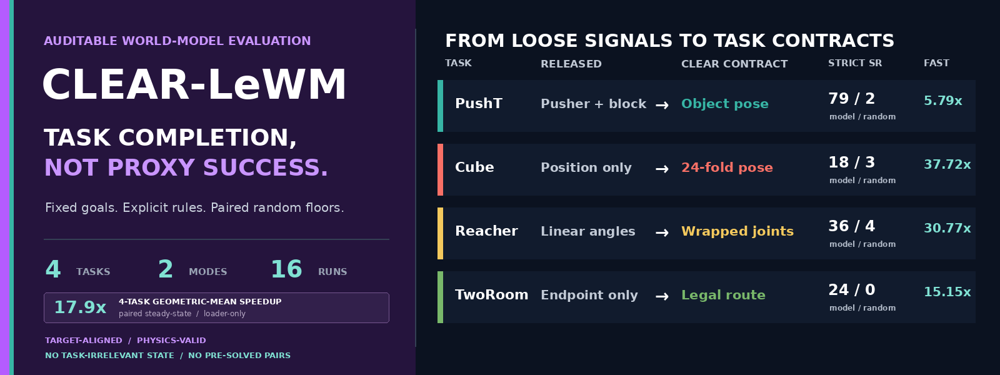
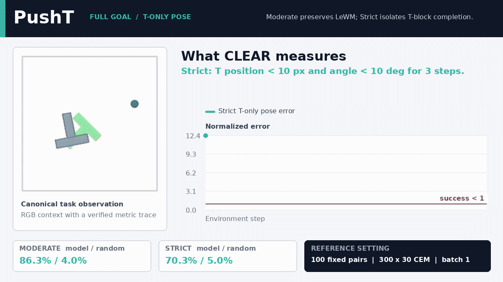
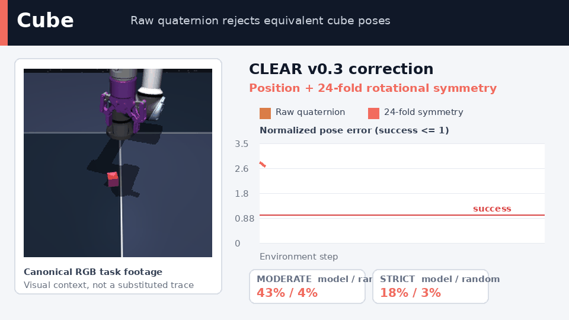
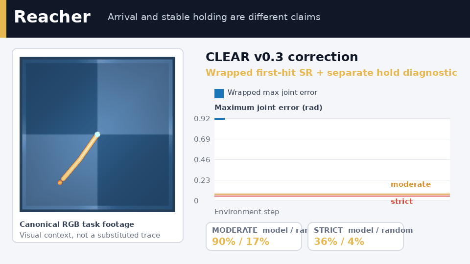
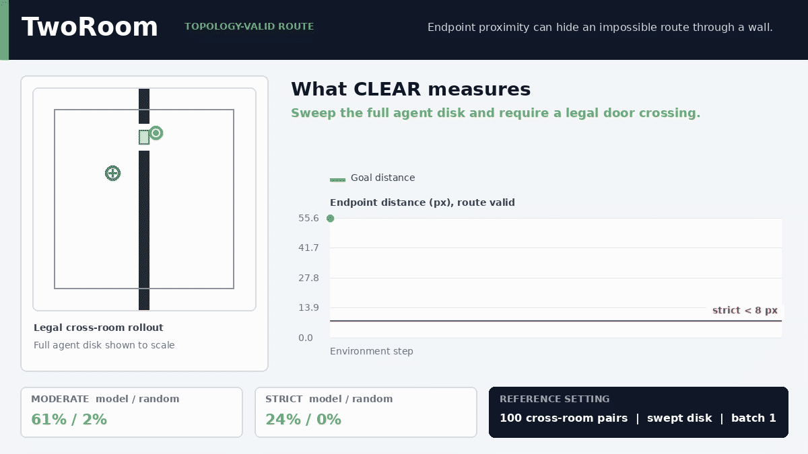

<p align="center">
  
</p>

<h1 align="center">CLEAR-LeWM</h1>

<p align="center">
  <a href="pyproject.toml"></a>
  <a href="LICENSE"></a>
  <a href="tests"></a>
  <a href="results/v0.3"></a>
  <a href="manifests/v0.3"></a>
</p>

<p align="center">
  <strong>Target-aligned success · Physics-valid trajectories · No task-irrelevant state · No pre-solved pairs</strong><br>
  CLEAR-LeWM freezes comparable goals, repairs task semantics, audits random floors,
  and records enough provenance to reproduce every reported success.
</p>

<p align="center">
  <strong>FAST training I/O: 17.87× geometric-mean loader speedup across four tasks</strong><br>
  <sub>5.79× PushT · 37.72× Cube · 30.77× Reacher · 15.15× TwoRoom · exact source-equivalence audits · <a href="PERFORMANCE.md">Performance audit</a></sub>
</p>

<p align="center">
  <a href="mailto:luoliibaqi4747@gmail.com"><strong>Junhan Sun</strong></a><sup>1</sup>
  &nbsp;&nbsp;
  <strong>Guofeng Zhang</strong><sup>1,&#8224;</sup>
  &nbsp;&nbsp;
  <strong>Hao Zhao</strong><sup>2,&#8224;</sup><br>
  <sub><sup>1</sup>State Key Laboratory of CAD&amp;CG, Zhejiang University &nbsp;|&nbsp;
  <sup>2</sup>Tsinghua University &nbsp;|&nbsp;
  <sup>&#8224;</sup>Corresponding authors</sub>
</p>

<p align="center">
  <a href="https://davidsunok.github.io/CLEAR-LeWM/"><strong>Website</strong></a> ·
  <a href="#results"><strong>Results</strong></a> ·
  <a href="#two-auditable-modes"><strong>Modes</strong></a> ·
  <a href="#01-pusht"><strong>Task Guides</strong></a> ·
  <a href="#quick-start"><strong>Quick Start</strong></a> ·
  <a href="EVALUATION_SPEC.md"><strong>Specification</strong></a> ·
  <a href="docs/SUBMITTING_RESULTS.md"><strong>Submit Results</strong></a> ·
  <a href="checkpoints/official-v0.3.json"><strong>Checkpoints</strong></a>
</p>

<h2 align="center">Four tasks. Eight judgements. One clear standard.</h2>

<p align="center">
  <a href="assets/showcase/clear_lewm_v03_overview_1080p.mp4">
    
  </a>
</p>

<p align="center">
  <strong>Left: released or naive rule. Right: CLEAR v0.3 task semantics.</strong><br>
  1280×720 animated preview. Click it for the 1920×1080 H.264 film. Every task segment uses benchmark RGB, verified metrics, or recorded rollout traces.
</p>

> [!IMPORTANT]
> CLEAR-LeWM is an independent community evaluation project, not an official
> LeWM release. The historical `official` track is preserved unchanged;
> `moderate` and `strict` make stronger, explicitly versioned claims.

> [!WARNING]
> Published comparisons use **solver batch size 1**. Batch 16 is a development
> throughput mode: it changes CEM random-number ordering and flipped 99/400
> episode outcomes in a controlled four-task audit.

## What v0.3 fixes

<table>
  <tr>
    <td width="25%"><a href="docs/tasks/PUSHT.md"><strong>PushT · object semantics</strong></a><br>Evaluate the T block, not the final pusher location.<br><sub><a href="docs/tasks/PUSHT.md">Manifest + rollout gates →</a></sub></td>
    <td width="25%"><a href="docs/tasks/CUBE.md"><strong>Cube · physical symmetry</strong></a><br>Respect all 24 equivalent cube rotations.<br><sub><a href="docs/tasks/CUBE.md">Manifest + rollout gates →</a></sub></td>
    <td width="25%"><a href="docs/tasks/REACHER.md"><strong>Reacher · honest dynamics</strong></a><br>Report wrapped first-hit SR and holding separately.<br><sub><a href="docs/tasks/REACHER.md">Manifest + rollout gates →</a></sub></td>
    <td width="25%"><a href="docs/tasks/TWOROOM.md"><strong>TwoRoom · valid topology</strong></a><br>Sweep the full agent disk and reject routes through walls.<br><sub><a href="docs/tasks/TWOROOM.md">Manifest + rollout gates →</a></sub></td>
  </tr>
</table>

The four fixes live in the evaluator, manifests, tests, reference outputs, and
task guides. v0.2 artifacts remain executable and are not silently rewritten.

## Results

Official high-epoch LeWM checkpoints on 100 deterministic pairs per protocol,
seed 42, `300 x 30` CEM, solver batch 1. Within every cell, the model and
random policy use the exact same manifest.

| Task | Historical Official model / random | Moderate model / random | Strict model / random | Strict excess |
|---|---:|---:|---:|---:|
| **PushT** | **89% / 7%** | **93% / 7%** | **79% / 2%** | **+77 pp** |
| **Cube** | **62% / 47%** | **43% / 4%** | **18% / 3%** | **+15 pp** |
| **Reacher** | **87% / 16%** | **90% / 17%** | **36% / 4%** | **+32 pp** |
| **TwoRoom** | **85% / 30%** | **61% / 2%** | **24% / 0%** | **+24 pp** |

Historical Official preserves upstream row-uniform sampling, initially solved
pairs, first-hit predicates, and the released sampling range. Its random floor
is therefore diagnostic; it is not a matched replacement for Moderate or
Strict.

TwoRoom is the strongest integrity check. On the same 100 Strict cross-room
goals, original endpoint dynamics reported 37%; only 6% of those unchanged
trajectories were route-valid. Swept collision recovers **24% legal SR** with
**0/100 invalid routes**.

Historical Official outputs are under
[`results/reference/`](results/reference/); v0.3 manifests and robust outputs
are versioned under [`manifests/v0.3/`](manifests/v0.3/) and
[`results/v0.3/`](results/v0.3/).
Calibration decisions are recorded in
[`docs/PROTOCOL_CALIBRATION.md`](docs/PROTOCOL_CALIBRATION.md).

## Community results

CLEAR-LeWM accepts public method results through auditable pull requests. A
submission keeps the fixed v0.3 manifests, records its training-data track and
inference budget, includes every episode outcome, and passes automated hash,
protocol, provenance, and metric checks. Results are labeled `self-reported`,
`reproducible`, or `maintainer-verified`; CI validity is never presented as an
independent reproduction.

[Submit a result or propose a new data track](docs/SUBMITTING_RESULTS.md).

## Two auditable modes

The robust benchmark has two modes. The separate `official` track exists only
for historical compatibility.

| Mode | Pair contract | Success contract | Intended claim |
|---|---|---|---|
| **Moderate** | episode-balanced, initially unsolved, task-level difficulty | semantically correct task completion with practical tolerance | robust in-distribution planning |
| **Strict** | initially unsolved, harder start-goal change | tighter geometry or topology with explicit temporal rule | conservative completion |

The words Moderate and Strict do not mean “use one threshold everywhere.” A
dynamic reach task, symmetric object, planar pushing task, and obstacle
navigation task require different predicates. Exact definitions are normative
in [`EVALUATION_SPEC.md`](EVALUATION_SPEC.md).

<details>
<summary><strong>Complete v0.3 mode matrix</strong></summary>

| Task | Moderate | Strict |
|---|---|---|
| PushT | block `<20 px`, `<20 deg`, hold 3, translation `>=25 px` | block `<15 px`, `<15 deg`, hold 5, translation `>=50 px` |
| Cube | `<=4 cm`, symmetry angle `<=30 deg`, hold 3 | `<=3 cm`, symmetry angle `<=15 deg`, hold 5 |
| Reacher | wrapped joint error `<0.075 rad`, first hit | wrapped joint error `<0.05 rad`, first hit |
| TwoRoom | cross-room, swept route, `<12 px`, hold 3 | cross-room, swept route, `<8 px`, hold 5 |

</details>

<p align="center">
  <strong>TASK-BY-TASK EVALUATION</strong><br>
  Each guide separates the released predicate, the failure mode, the corrected rule, and the paired random floor.
</p>

## 01. PushT

**Success belongs to the object.**

> **FAST input: 5.79x loader throughput vs Lance.** Exact-audited pixels,
> action chunks, proprio, state, and episode boundaries.

The released predicate includes both pusher and block position. A correctly
placed T block can therefore fail because the pusher stops elsewhere; pusher
travel can also masquerade as task difficulty. CLEAR uses block pose and block
translation only.

<p align="center">
  
</p>

| Audit question | PushT definition |
|---|---|
| **Evaluation target** | Place the T block at the goal pose; the pusher endpoint is irrelevant. |
| **Released issue** | Combined pusher-plus-block position can reject a correct object placement and lets pusher travel masquerade as task difficulty. |
| **CLEAR correction** | Evaluate block position and angle only; define pair difficulty from block displacement. |
| **What this prevents** | False failures caused by where the pusher stops, and inflated capability from pusher-only motion. |

**Moderate 93% / 7% · Strict 79% / 2%.**
[Read the PushT evaluation guide](docs/tasks/PUSHT.md).

## 02. Cube

**Equivalent rotations stay equivalent.**

> **FAST input: 37.72x loader throughput vs HDF5.** Exact-audited pixels,
> action chunks, observations, merged 19-D proprio, and episode boundaries.

The dataset samples target yaw, while upstream success checks only position.
Raw quaternion matching is not a complete repair because a cube has 24 proper
rotational symmetries. CLEAR minimizes geodesic error over that symmetry group.

<p align="center">
  
</p>

| Audit question | Cube definition |
|---|---|
| **Evaluation target** | Match cube position and physical orientation at the target. |
| **Released issue** | Position-only success credits an unfinished pose; raw quaternion matching can reject physically equivalent cube rotations. |
| **CLEAR correction** | Require position accuracy and minimize geodesic rotation error over all 24 proper cube symmetries. |
| **What this prevents** | Both loose position-only false positives and symmetry-blind false negatives. |

**Moderate 43% / 4% · Strict 18% / 3%.**
[Read the Cube evaluation guide](docs/tasks/CUBE.md).

## 03. Reacher

**Arrival is not stabilization.**

> **FAST input: 30.77x loader throughput vs HDF5.** Exact-audited pixels,
> action chunks, observations, and episode boundaries.

The released task is first-hit joint matching. CLEAR wraps periodic angles and
keeps first-hit SR as the primary metric. Multi-step holding and terminal speed
are reported as separate control diagnostics.

<p align="center">
  
</p>

| Audit question | Reacher definition |
|---|---|
| **Evaluation target** | Reach the goal joint configuration under periodic joint geometry. |
| **Released issue** | Linear joint subtraction is distorted at the periodic boundary, while first-hit success alone does not establish stabilization. |
| **CLEAR correction** | Use wrapped first-hit joint error as SR; report holding and terminal speed as separate diagnostics. |
| **What this prevents** | Coordinate-seam errors and claims that silently conflate arrival with stable control. |

**Moderate 90% / 17% · Strict 36% / 4%.** Requiring Strict hold-2 instead
changes the model/random result to 1% / 0%, which is a different claim.
[Read the Reacher evaluation guide](docs/tasks/REACHER.md).

## 04. TwoRoom

**An endpoint is not a route.**

> **FAST input: 15.15x loader throughput vs HDF5.** Exact-audited pixels,
> action chunks, proprio, and episode boundaries.

When start and goal are separated by a wall, the complete agent disk must pass
through a door. CLEAR performs continuous swept-circle collision, erodes each
door by the agent radius, and requires a valid room crossing before success.

<p align="center">
  
</p>

| Audit question | TwoRoom definition |
|---|---|
| **Evaluation target** | Reach a cross-room goal through the door with the complete agent disk. |
| **Released issue** | Endpoint proximity and endpoint-only collision can credit trajectories that pass through a wall or an unusable door edge. |
| **CLEAR correction** | Apply swept-circle collision, full-radius door clearance, and a mandatory valid-route gate. |
| **What this prevents** | Success credit for physically impossible wall penetration or invalid room crossings. |

**Moderate 61% / 2% · Strict 24% / 0% · invalid routes 0/100.**
[Read the TwoRoom guide](docs/tasks/TWOROOM.md) or
[watch the dedicated 1080p topology film](assets/showcase/tworoom_topology_1080p.mp4).

## Quick Start

### 1. Install

```bash
git clone --recurse-submodules https://github.com/DavidSunok/CLEAR-LeWM.git
cd CLEAR-LeWM
python -m venv .venv
source .venv/bin/activate
pip install -e '.[dev,lewm]'
```

### 2. Prepare verified official checkpoints

```bash
python scripts/prepare_official_checkpoints.py --cache-dir "$STABLEWM_HOME"
```

The downloader pins four upstream revisions, checks the immutable source
weight SHA-256, reconstructs the model, and strictly loads **303/303 tensors**.
The release registry is [`checkpoints/official-v0.3.json`](checkpoints/official-v0.3.json).
Binary weights are intentionally not committed to ordinary Git.

### 3. Evaluate random and model on identical pairs

```bash
clear-lewm evaluate \
  --manifest manifests/v0.3/tworoom/strict-seed42-n100.json \
  --policy random --cache-dir "$STABLEWM_HOME" \
  --dataset-path /path/to/tworoom.h5 \
  --solver-batch-size 1 \
  --output results/tworoom-strict-random.json

clear-lewm evaluate \
  --manifest manifests/v0.3/tworoom/strict-seed42-n100.json \
  --policy official/tworoom --policy-label official-lewm \
  --cache-dir "$STABLEWM_HOME" \
  --dataset-path /path/to/tworoom.h5 \
  --solver-batch-size 1 --strict-checkpoint \
  --random-results results/tworoom-strict-random.json \
  --output results/tworoom-strict-lewm.json
```

The output contains the manifest hash, embedded criterion, per-episode outcomes,
paired random gain, checkpoint revision and hashes, environment fingerprint,
solver settings, and task-specific topology diagnostics.

### Planning mode must be explicit

For representation-only planning comparisons, pass `--actor-warmstart off`.
This records audited **pure-CEM**. The default `auto` preserves checkpoint
configuration and may initialize CEM from an action prior.

For action-head-only evaluation, use `--inference-mode direct` with
`--actor-warmstart on`, an explicit `--direct-target-mode`, and the checkpoint's
verified runtime directory. CLEAR records the solver source SHA-256.

## Reproducibility contract

Every matched comparison must share:

1. manifest and dataset fingerprint;
2. environment, physics, action bounds, and evaluation budget;
3. policy, solver, and environment seeds;
4. planner samples, iterations, top-k, and **batch size 1**;
5. task criterion and protocol version.

MuJoCo, Pymunk, dm-control, Gymnasium, task source, PyTorch, CUDA, cuDNN,
accelerator, evaluator source, and custom Hydra targets are fingerprinted.
See [`docs/RUNTIME_REPRODUCIBILITY.md`](docs/RUNTIME_REPRODUCIBILITY.md).

## Official compatibility and history

`official` preserves upstream row-uniform sampling, initially solved starts,
first-hit predicates, and the released off-by-one sampling range. It is useful
for historical comparison, not a strong completion benchmark.

The v0.2 manifests and 24 reference outputs remain under
[`manifests/`](manifests/) and [`results/reference/`](results/reference/).
Their embedded protocols remain executable. v0.3 never mutates an archived
result in place.

## FAST and runtime performance

FAST is an audited training I/O path, not a new dataset. It decodes once,
stores row-major memmaps, preserves complete action chunks, and verifies tensor
equivalence against the source reader.

| Training input | Source samples/s | FAST samples/s | Paired speedup |
|---|---:|---:|---:|
| PushT / Lance | 672.3 | 3812.0 | **5.79x** |
| Cube / HDF5 | 119.5 | 4426.5 | **37.72x** |
| Reacher / HDF5 | 143.0 | 4362.1 | **30.77x** |
| TwoRoom / HDF5 | 279.2 | 4291.4 | **15.15x** |

The four-task aggregate is **17.87x geometric-mean steady-state loader
speedup**; the arithmetic mean is 22.36x. These numbers exclude one-time
conversion and model compute. A separate historical PushT run observed **1.8x
end-to-end training throughput**; development CEM batch 16 observed **1.49x
evaluation throughput** but changes planner trajectories and is never used for
published tables.

Batch 16 is faster but not numerically equivalent. Published reference tables
and model selection stay at batch 1. Full measurements and negative results are
in [`PERFORMANCE.md`](PERFORMANCE.md).

## Data contract

| PushT | Cube | Reacher | TwoRoom |
|---|---|---|---|
| Lance -> exact-audited FAST | HDF5 -> exact-audited FAST | HDF5 -> exact-audited FAST | HDF5 -> exact-audited FAST |

Evaluation manifests always reference canonical HDF5 row IDs. Training may use
HDF5, Lance, or FAST only after episode boundaries, action chunks,
normalization, and RGB tensors pass [`DATA_SPEC.md`](DATA_SPEC.md).

## Repository map

| Path | Purpose |
|---|---|
| [`clear_lewm/`](clear_lewm) | task semantics, topology, manifests, metrics, and runner |
| [`manifests/v0.3/`](manifests/v0.3) | immutable Moderate and Strict pair sets |
| [`results/v0.3/`](results/v0.3) | 16 official-LeWM and random audited outputs |
| [`docs/tasks/`](docs/tasks) | task-by-task evaluation guides |
| [`checkpoints/`](checkpoints) | official revision and hash registry |
| [`assets/showcase/`](assets/showcase) | 1080p overview and topology films |
| [`scripts/build_v03_media.py`](scripts/build_v03_media.py) | synchronized task GIF and 1080p comparison-film generator |
| [`assets/media_sources/`](assets/media_sources) | recorded comparison traces and result summaries used by the media builder |
| [`scripts/`](scripts) | checkpoint, FAST, environment, and remaining utility scripts |
| [`third_party/le-wm/`](third_party/le-wm) | pinned upstream LeWM submodule |

## Scope and attribution

LeWorldModel remains authored and licensed by its upstream authors. PushT,
Cube, and Reacher media sample RGB and metrics from the same canonical episode
indices; TwoRoom uses recorded rollout trajectories. See
[`NOTICE.md`](NOTICE.md) and [`docs/AUDIT_FINDINGS.md`](docs/AUDIT_FINDINGS.md).
