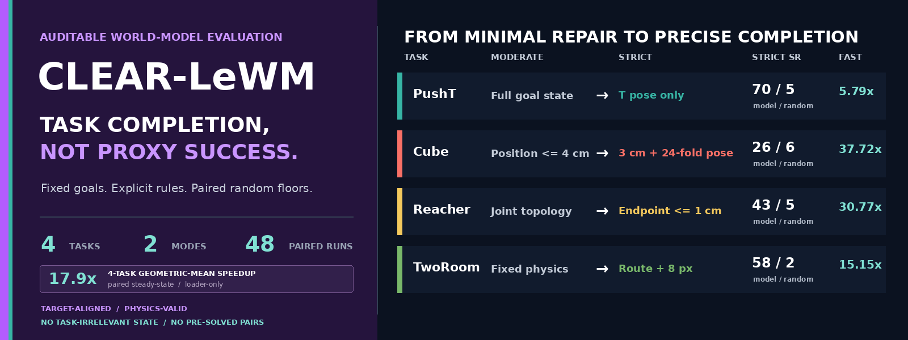

<p align="center">
  
</p>

<h1 align="center">CLEAR-LeWM</h1>

<p align="center">
  <a href="pyproject.toml"></a>
  <a href="LICENSE"></a>
  <a href=".github/workflows/ci.yml"></a>
  <a href="results/v0.5"></a>
  <a href="manifests/v0.5"></a>
</p>

<p align="center">
  <strong>Minimal evaluator repair when comparability matters. Task-semantic precision when completion matters.</strong><br>
  CLEAR-LeWM removes pre-solved cases, repairs demonstrated evaluator defects,
  freezes paired manifests, and exposes every success decision for audit.
</p>

<p align="center">
  <a href="mailto:luoliibaqi4747@gmail.com"><strong>Junhan Sun</strong></a><sup>1</sup>
  &nbsp;&nbsp;
  <strong>Guofeng Zhang</strong><sup>1,&#8224;</sup>
  &nbsp;&nbsp;
  <strong>Hao Zhao</strong><sup>2,&#8224;</sup><br>
  <sub><sup>1</sup>State Key Laboratory of CAD&amp;CG, Zhejiang University &nbsp;|&nbsp;
  <sup>2</sup>Tsinghua University &nbsp;|&nbsp;
  <sup>&#8224;</sup>Corresponding authors</sub>
</p>

<p align="center">
  <a href="https://davidsunok.github.io/CLEAR-LeWM/"><strong>Website</strong></a> &middot;
  <a href="#reference-results"><strong>Results</strong></a> &middot;
  <a href="#two-auditable-modes"><strong>Modes</strong></a> &middot;
  <a href="EVALUATION_SPEC.md"><strong>Specification</strong></a> &middot;
  <a href="docs/SUBMITTING_RESULTS.md"><strong>Submit Results</strong></a> &middot;
  <a href="checkpoints/official-v0.5.json"><strong>Checkpoints</strong></a>
</p>

<p align="center">
  <a href="assets/showcase/clear_lewm_v05_overview_1080p.mp4">
    
  </a>
</p>

> [!IMPORTANT]
> CLEAR-LeWM is an independent community evaluation project, not an official
> LeWM release. It reevaluates pinned official LeWM checkpoints and preserves
> their provenance. The checked-in reference table contains only official LeWM
> and paired-random results.

> [!WARNING]
> Published comparisons use **solver batch size 1**. Batch 16 changes CEM
> random-number ordering and is a development throughput mode, not a matched
> reference setting.

## Why CLEAR-LeWM

The historical stack mixes genuinely difficult control with evaluator effects:
initially solved start-goal pairs, incorrect Reacher angle topology, and a
TwoRoom rewrite whose endpoint-only collision check can admit an invalid wall
crossing. Cube also has a high random floor because many sampled windows do not
move the cube.

CLEAR-LeWM separates two scientific questions instead of forcing one rule to
answer both.

## Two auditable modes

| Mode | Scientific question | Design rule |
|---|---|---|
| **Moderate** | Does a method improve LeWM after fixing evaluator bugs and trivial cases? | Change as little as possible; preserve released PushT and Cube predicates. |
| **Strict** | Does the rollout precisely complete the task-relevant physical goal? | Score the object or endpoint, tighten geometry, and require short persistence where appropriate. |

| Task | v0.5 Moderate | v0.5 Strict |
|---|---|---|
| **PushT** | pusher + T position `<20 px`; T angle `<20 deg`; first hit | T only `<10 px / 10 deg`; hold 3 |
| **Cube** | cube center `<=4 cm`; first hit | cube center `<=3 cm` + 24-fold orientation `<=15 deg`; hold 3 |
| **Reacher** | periodic shoulder + bounded wrist `<0.05 rad`; first hit | fingertip endpoint `<=1 cm`; hold 2 |
| **TwoRoom** | clean cross-room pair; swept disk; endpoint `<16 px` | valid legal crossing + goal side + endpoint `<8 px` |

Moderate is the closest corrected continuation of the released benchmark.
Strict is the stronger semantic claim. They must be reported as separate
columns. Exact inequalities and runtime gates are normative in
[`EVALUATION_SPEC.md`](EVALUATION_SPEC.md).

## Reference results

Only pinned official high-epoch LeWM checkpoints and paired random policies are
checked in. All official runs use 100 episodes, `300 x 30` CEM, top-k 30,
solver batch size 1, and strict 303/303 tensor loading.

### Moderate: seeds 0, 1, and 42

Mean +/- sample standard deviation across complete paired runs:

| Task | Official LeWM | Paired random | Excess |
|---|---:|---:|---:|
| **PushT** | **86.33 +/- 2.08%** | 4.00 +/- 1.00% | **+82.33 pp** |
| **Cube** | **50.33 +/- 4.04%** | 15.67 +/- 6.03% | **+34.67 pp** |
| **Reacher** | **46.00 +/- 5.57%** | 4.33 +/- 1.15% | **+41.67 pp** |
| **TwoRoom** | **84.00 +/- 3.00%** | 6.67 +/- 1.15% | **+77.33 pp** |

### Strict: seeds 0, 1, and 42

Mean +/- sample standard deviation across complete paired runs:

| Task | Official LeWM | Paired random | Mean excess |
|---|---:|---:|---:|
| **PushT** | **70.33 +/- 4.04%** | 5.00 +/- 1.73% | **+65.33 pp** |
| **Cube** | **26.33 +/- 1.53%** | 6.00 +/- 2.65% | **+20.33 pp** |
| **Reacher** | **43.00 +/- 7.21%** | 5.00 +/- 3.46% | **+38.00 pp** |
| **TwoRoom** | **58.33 +/- 2.31%** | 1.67 +/- 2.89% | **+56.67 pp** |

The JSON files in [`results/v0.5/`](results/v0.5/) are the source of truth.
They include all episode outcomes, manifest hashes, criteria, solver settings,
environment fingerprints, checkpoint hashes, and topology diagnostics.

## Task guides

### 01. PushT

<p align="center"></p>

Moderate preserves the complete pusher-plus-block goal state. Strict asks the
task-semantic question: is the T itself placed correctly? A full-image latent
cost can therefore differ from Strict completion, and methods should disclose
their planning target. [Read the PushT guide](docs/tasks/PUSHT.md).

### 02. Cube

<p align="center"></p>

Moderate follows OGBench's 4 cm cube-position task. Strict adds a 3 cm position
gate and 15 degree orientation modulo all 24 proper cube rotations. Neither
mode scores terminal robot pose. [Read the Cube guide](docs/tasks/CUBE.md).

### 03. Reacher

<p align="center"></p>

Moderate repairs the shoulder/wrist topology while preserving joint matching.
Strict scores the physical fingertip endpoint for two consecutive steps.
[Read the Reacher guide](docs/tasks/REACHER.md).

### 04. TwoRoom

<p align="center"></p>

Both modes reject polluted source windows and execute corrected swept-disk
physics. Strict additionally requires a legal room crossing, goal-side arrival,
and an 8 px endpoint. [Read the TwoRoom guide](docs/tasks/TWOROOM.md).

## Quick start

```bash
git clone --recurse-submodules https://github.com/DavidSunok/CLEAR-LeWM.git
cd CLEAR-LeWM
python -m venv .venv
source .venv/bin/activate
pip install -e '.[dev,lewm]'
python scripts/prepare_official_checkpoints.py --cache-dir "$STABLEWM_HOME"
```

Evaluate the identical Strict pair set with random and official LeWM:

```bash
clear-lewm evaluate \
  --manifest manifests/v0.5/tworoom/strict-seed42-n100.json \
  --policy random --cache-dir "$STABLEWM_HOME" \
  --dataset-path /path/to/tworoom.h5 \
  --solver-batch-size 1 \
  --output results/tworoom-v05-strict-random.json

clear-lewm evaluate \
  --manifest manifests/v0.5/tworoom/strict-seed42-n100.json \
  --policy official/tworoom/weights.pt --policy-label official-lewm \
  --cache-dir "$STABLEWM_HOME" \
  --dataset-path /path/to/tworoom.h5 \
  --num-samples 300 --n-steps 30 --topk 30 \
  --solver-batch-size 1 --strict-checkpoint \
  --random-results results/tworoom-v05-strict-random.json \
  --output results/tworoom-v05-strict-lewm.json
```

For representation-only planning comparisons, pass `--actor-warmstart off`.
For action-head-only evaluation, use `--inference-mode direct`, an explicit
`--direct-target-mode`, and a verified custom runtime directory.

## Audited FAST training I/O

FAST is an optional derived reader, not a new dataset. It decodes once into
verified row-major memory maps while preserving complete action chunks and
episode boundaries.

| Training input | Source samples/s | FAST samples/s | Paired speedup |
|---|---:|---:|---:|
| PushT / Lance | 672.3 | 3812.0 | **5.79x** |
| Cube / HDF5 | 119.5 | 4426.5 | **37.72x** |
| Reacher / HDF5 | 143.0 | 4362.1 | **30.77x** |
| TwoRoom / HDF5 | 279.2 | 4291.4 | **15.15x** |

The four-task geometric-mean loader speedup is **17.87x**. These figures
exclude conversion and model compute. See [`PERFORMANCE.md`](PERFORMANCE.md).

## Reproducibility contract

Every matched comparison must share the manifest, dataset fingerprint,
environment, policy seed, control budget, solver budget, solver batch size,
and protocol mode. MuJoCo, Pymunk, dm-control, Gymnasium, PyTorch, CUDA, cuDNN,
task source, checkpoint source, and evaluator source are fingerprinted.

The pinned official source revisions and hashes are in
[`checkpoints/official-v0.5.json`](checkpoints/official-v0.5.json). Binary
weights and datasets remain outside ordinary Git.

## Community results

Public methods may submit auditable v0.5 Moderate and/or Strict result bundles.
CI verifies structure, canonical manifest hashes, trace arithmetic, provenance,
and topology. It does not imply independent reproduction or endorsement.

<!-- community-leaderboard:start -->

Canonical community entries use policy seed 42 and 100 episodes per
task/mode. Values are **model / paired random (excess)**. CI validates
the bundle structure, canonical manifests, trace arithmetic, provenance,
and topology; the verification label states whether execution was
independently reproduced.

| Method | Task | Moderate | Strict | Verification |
|---|---|---:|---:|---|
| [DINOv2 No-Proprio LeWM](submissions/zerotul782231/dinov2-no-proprio-lewm-141dc536/METHOD_CARD.md) | PushT | 8% / 3% (+5 pp) | 7% / 7% (0 pp) | self-reported; [@zerotul782231](https://github.com/zerotul782231) |
|  | Cube | 43% / 15% (+28 pp) | 17% / 8% (+9 pp) |  |
|  | Reacher | - | - |  |
|  | TwoRoom | 55% / 6% (+49 pp) | 26% / 0% (+26 pp) |  |
| [GCBC Joint LeWM](submissions/zerotul782231/gcbc-joint-lewm-141dc536/METHOD_CARD.md) | PushT | 9% / 3% (+6 pp) | 9% / 7% (+2 pp) | self-reported; [@zerotul782231](https://github.com/zerotul782231) |
|  | Cube | 16% / 15% (+1 pp) | 3% / 8% (-5 pp) |  |
|  | Reacher | - | - |  |
|  | TwoRoom | 15% / 6% (+9 pp) | 9% / 0% (+9 pp) |  |

A dash means that task/mode was not submitted. Supplementary evidence
that does not match the canonical manifest/seed contract remains in each
method card and is not mixed into this table.

<!-- community-leaderboard:end -->

[Read the submission guide](docs/SUBMITTING_RESULTS.md).

## Repository map

| Path | Purpose |
|---|---|
| [`clear_lewm/`](clear_lewm) | evaluator, manifests, task metrics, topology, submissions |
| [`manifests/v0.5/`](manifests/v0.5) | canonical Moderate/Strict manifests |
| [`results/v0.5/`](results/v0.5) | official LeWM and paired-random reference results |
| [`submissions/leaderboard.json`](submissions/leaderboard.json) | generated community-result registry |
| [`docs/tasks/`](docs/tasks) | task objectives, gates, and reproduction commands |
| [`scripts/build_v05_media.py`](scripts/build_v05_media.py) | synchronized GIF and 1080p overview generator |
| [`tests/`](tests) | protocol, manifest, runtime, result, and submission regressions |

## License and attribution

CLEAR-LeWM is MIT licensed. Upstream LeWM, stable-worldmodel, OGBench, DMC,
Pymunk, MuJoCo, PLDM, and DINO-WM components remain under their own licenses
and attribution requirements.
