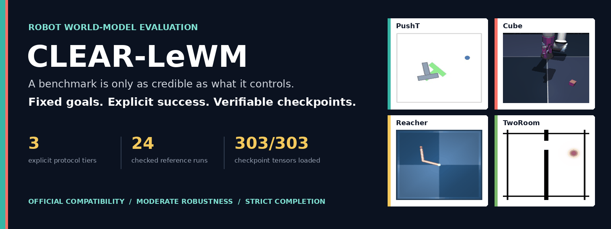
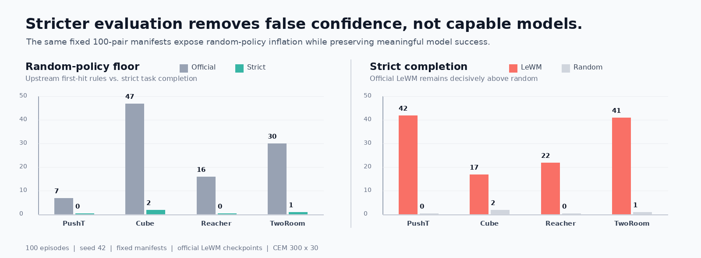
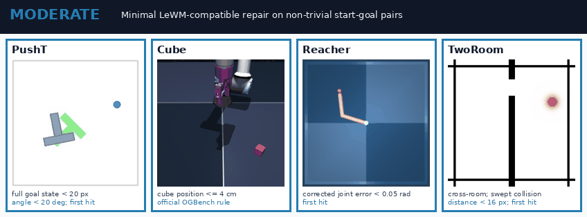

<p align="center">
  
</p>

<p align="center">
  <a href="https://github.com/DavidSunok/CLEAR-LeWM/releases"></a>
  <a href="pyproject.toml"></a>
  <a href="LICENSE"></a>
  <a href="tests"></a>
  <a href="manifests"></a>
  <a href="results/reference"></a>
</p>

<p align="center">
  <strong>Controlled · Leakage-aware · Episode-balanced · Auditable · Reproducible</strong>
</p>

<p align="center">
  <a href="#why-clear-lewm">Why CLEAR-LeWM</a> ·
  <a href="#headline-results">Results</a> ·
  <a href="#quick-start">Quick Start</a> ·
  <a href="#three-explicit-tiers">Protocols</a> ·
  <a href="#fast-and-runtime">FAST & Runtime</a> ·
  <a href="PERFORMANCE.md">Performance Audit</a>
</p>

<table>
  <tr>
    <td width="33%" align="center">
      <strong>Success means completion</strong><br>
      Task-aware geometry and sustained success replace ambiguous first contact.
    </td>
    <td width="33%" align="center">
      <strong>Every comparison is paired</strong><br>
      One immutable manifest drives the model and its deterministic random floor.
    </td>
    <td width="33%" align="center">
      <strong>Every artifact is traceable</strong><br>
      Dataset, checkpoint, solver, protocol, and per-episode outcomes carry hashes.
    </td>
  </tr>
</table>

> [!IMPORTANT]
> CLEAR-LeWM is an independent community project, not an official LeWM release.
> `official` reproduces upstream behavior; `moderate` and `strict` make stronger
> completion claims measurable without silently rewriting the historical track.

## Why CLEAR-LeWM

LeWM selects a goal 25 dataset steps into the future and gives the controller a
50-step budget. The goal is reachable, but the reported success rate can still
be inflated by **row-biased sampling, already-solved starts, first-hit
termination, train/eval trajectory overlap, and incomplete task predicates**.

On the canonical snapshots, upstream predicates already mark **38.38% of Cube**
and **8.82% of TwoRoom** start-goal pairs successful before control. Our fixed
official manifests then produce random-policy SR of **47% on Cube** and **30%
on TwoRoom**. A high number is not automatically a capable planner.

<p align="center">
  
</p>

<table>
  <tr>
    <td width="33%"><strong>Diagnose</strong><br>Measure initial-success floors and a paired random policy before interpreting model SR.</td>
    <td width="33%"><strong>Correct</strong><br>Balance episodes, remove trivial pairs, restore missing task geometry, and require stable attainment.</td>
    <td width="33%"><strong>Reproduce</strong><br>Freeze pair IDs, criteria, checkpoint identity, planner budget, versions, and all 100 outcomes.</td>
  </tr>
</table>

## Headline Results

Each cell is **official LeWM / deterministic random** on the same 100-pair,
seed-42 manifest with upstream `300 x 30` CEM.

| Task | Official compatibility | Moderate robustness | Strict completion |
|---|---:|---:|---:|
| **PushT** | **89% / 7%** | **74% / 0%** | **42% / 0%** |
| **Reacher** | **87% / 16%** | **63% / 6%** | **22% / 0%** |
| **TwoRoom** | **85% / 30%** | **70% / 17%** | **41% / 1%** |
| **Cube** | **62% / 47%** | **36% / 3%** | **17% / 2%** |

Strict evaluation lowers absolute SR by design, yet every verified checkpoint
remains above random. Moderate Cube is especially revealing: raw SR decreases,
while model excess over random grows from **15pp to 33pp**. The benchmark is
harder and more informative at the same time.

All 24 JSON outputs, per-episode traces, manifests, and source checkpoint hashes
are checked into [`results/reference/`](results/reference). Calibration choices
and rejected alternatives are documented in
[`docs/PROTOCOL_CALIBRATION.md`](docs/PROTOCOL_CALIBRATION.md).

## Quick Start

### 1. Install

```bash
git clone --recurse-submodules https://github.com/DavidSunok/CLEAR-LeWM.git
cd CLEAR-LeWM
python -m venv .venv
source .venv/bin/activate
pip install -e '.[dev,lewm]'
```

### 2. Prepare revision-pinned official checkpoints

```bash
python scripts/prepare_official_checkpoints.py --cache-dir "$STABLEWM_HOME"
```

### 3. Freeze one manifest, then evaluate random and model on identical pairs

```bash
clear-lewm manifest /path/to/tworoom.h5 \
  --task tworoom --protocol moderate --num-eval 100 --seed 42 \
  --output manifests/tworoom/moderate-seed42-n100.json

clear-lewm evaluate \
  --manifest manifests/tworoom/moderate-seed42-n100.json \
  --policy random --cache-dir "$STABLEWM_HOME" \
  --dataset-path /path/to/tworoom.h5 \
  --output results/tworoom-random.json

clear-lewm evaluate \
  --manifest manifests/tworoom/moderate-seed42-n100.json \
  --policy official/tworoom --policy-label official-lewm \
  --cache-dir "$STABLEWM_HOME" --dataset-path /path/to/tworoom.h5 \
  --random-results results/tworoom-random.json \
  --output results/tworoom-lewm.json
```

The output includes the manifest hash, embedded protocol, task criterion,
checkpoint provenance, solver budget, runtime settings, package versions,
confidence interval, paired gain, and every episode outcome.

## Three Explicit Tiers

| Tier | Pair sampling | Initially solved pairs | Success rule | Intended claim |
|---|---|---|---|---|
| `official` | upstream row-uniform | retained | upstream first hit | historical compatibility |
| `moderate` | episode-balanced | removed | calibrated target held 2-3 steps | robust in-distribution planning |
| `strict` | balanced + difficulty floor | removed | tighter target held 2-5 steps | conservative task completion |

<p align="center">
  
</p>

Thresholds, inequalities, temporal rules, split semantics, and the retained
upstream off-by-one behavior are normative in
[`EVALUATION_SPEC.md`](EVALUATION_SPEC.md). Data split is orthogonal to rigor:
use `--split heldout` only for a model retrained without those held-out episode
IDs.

## Audit Trail

```text
canonical dataset
      -> immutable 100-pair manifest
      -> deterministic random floor
      -> model on the exact same pairs
      -> paired report + hashes + per-episode trace
```

The four official mirrors are pinned by Hugging Face revision and source
SHA-256. Preparation reconstructs the runtime architecture, strictly loads
**303/303 tensors**, and emits a provenance sidecar. This prevents a dangerous
failure mode where a permissive state-dict load leaves the encoder randomly
initialized. See [`docs/OFFICIAL_CHECKPOINTS.md`](docs/OFFICIAL_CHECKPOINTS.md).

## FAST and Runtime

<table>
  <tr>
    <td width="33%" align="center"><strong>9.25x</strong><br>loader-only FAST vs. Lance</td>
    <td width="33%" align="center"><strong>1.8x</strong><br>observed end-to-end training throughput</td>
    <td width="33%" align="center"><strong>1.49x</strong><br>development CEM throughput at batch 16</td>
  </tr>
</table>

FAST is an audited **training I/O path**, not a new dataset. It decodes once,
stores row-major memmaps, preserves every action in each chunk, applies
frameskip only to observations, and still executes the configured transform.
The corrected implementation adds schema/completion checks, exact shape and
episode validation, source-safe resume, batched conversion, and seeded tensor
equivalence auditing.

The isolated PushT benchmark measured **4,661 vs. 504 samples/s**. A historical
H200 run observed **11.0 vs. 6.1 training steps/s**. FAST trades storage for
decode time: PushT occupies about 328 GiB and belongs on local NVMe.

<details>
<summary><strong>Convert, audit, and benchmark a FAST snapshot</strong></summary>

```bash
python scripts/preprocess_fast_dataset.py \
  --source pusht_expert_train.lance \
  --cache-dir "$STABLEWM_HOME" \
  --output /local-nvme/pusht-fast

python scripts/audit_fast_dataset.py \
  --source pusht_expert_train.lance \
  --cache-dir "$STABLEWM_HOME" \
  --fast-dir /local-nvme/pusht-fast

python scripts/benchmark_fast_dataset.py \
  --source pusht_expert_train.lance \
  --cache-dir "$STABLEWM_HOME" \
  --fast-dir /local-nvme/pusht-fast
```

</details>

For development sweeps, `--solver-batch-size 16` reduces the two PushT Strict
CEM calls from 112.8 s to 75.6 s. It also reorders CEM random draws and changes
SR, so **published reference tables must remain at upstream batch 1**. The full
safe/throughput boundary, TF32 negative result, CPU-thread audit, and raw records
live in [`PERFORMANCE.md`](PERFORMANCE.md) and [`benchmarks/`](benchmarks).

## Data Contract

| PushT | Cube | Reacher | TwoRoom |
|---|---|---|---|
| Lance | HDF5 | HDF5 | HDF5 |

These are four fixed **logical datasets**, not interchangeable filenames.
Evaluation uses canonical HDF5 row IDs. HDF5, Lance, or FAST may be used for
training only after episode boundaries, action chunks, normalization, and RGB
tensors pass the format-equivalence contract in [`DATA_SPEC.md`](DATA_SPEC.md).

## Repository Map

| Path | Purpose |
|---|---|
| [`clear_lewm/`](clear_lewm) | protocols, manifests, audits, metrics, and runner |
| [`manifests/`](manifests) | immutable 100-pair task/tier manifests |
| [`results/reference/`](results/reference) | 24 random and official-LeWM reference outputs |
| [`benchmarks/`](benchmarks) | FAST and CEM performance measurements |
| [`scripts/`](scripts) | checkpoint preparation, conversion, audit, and asset builders |
| [`third_party/le-wm/`](third_party/le-wm) | pinned upstream LeWM submodule |

## Scope and Attribution

LeWorldModel remains authored and licensed by its upstream authors. CLEAR-LeWM
contains no private SICJEPA code, private checkpoints, datasets, or unpublished
experiment logs. README visuals use RGB frames from the public LeWM datasets
solely to identify benchmark tasks. See [`NOTICE.md`](NOTICE.md) and
[`docs/AUDIT_FINDINGS.md`](docs/AUDIT_FINDINGS.md).
